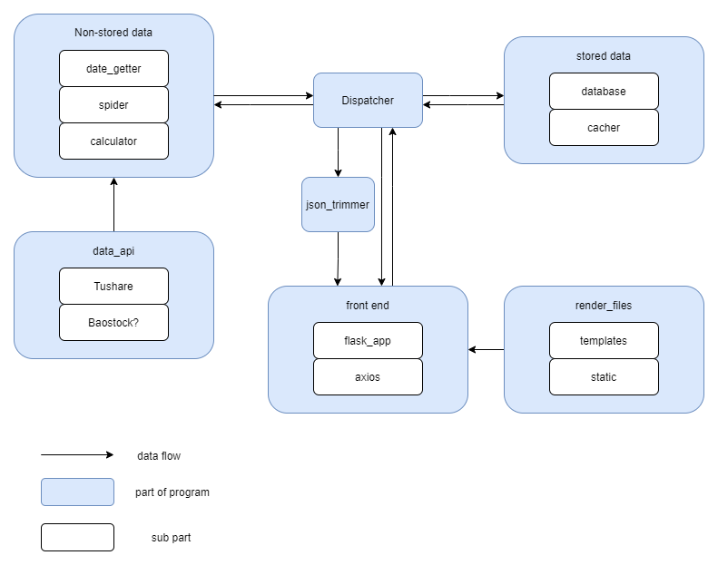
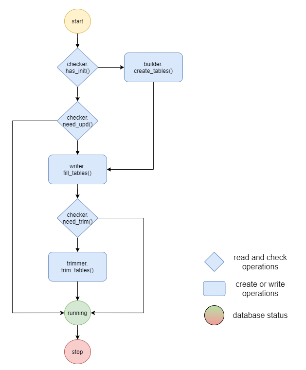

# Kevyn's Vein Project 开发文档

## 项目结构与工作流程

### 整体结构

下面这张图片展示了本项目的简单结构。

 在此结构图中，有以下几个点需要注意：

- `Dispatcher` 部分的数据处理应该始终保持其**对称性**， 也就是说，图中进入和离开 `dispatcher` 的的箭头所代表的数据应该具有完全相同的格式，
- 除了 `Non-stored data` 部分之外， 程序的其他部分不应该对 `data_api ` 部分有任何直接依赖，这意味着，`dispatcher` 是整个程序中唯一公共的数据交换接口。也意味着 `dispathcer` 将始终用于保持数据流的稳定中间形式，不受其他部分变动的干扰。
  - `stored data` 部分`front end` 的`Python` 部分不应该操作数据。

这其中，几个重要部分的结构或工作流程见下。

### 数据库

数据库的生命周期：

